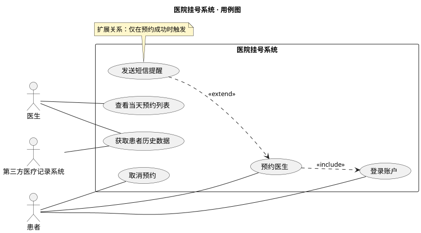
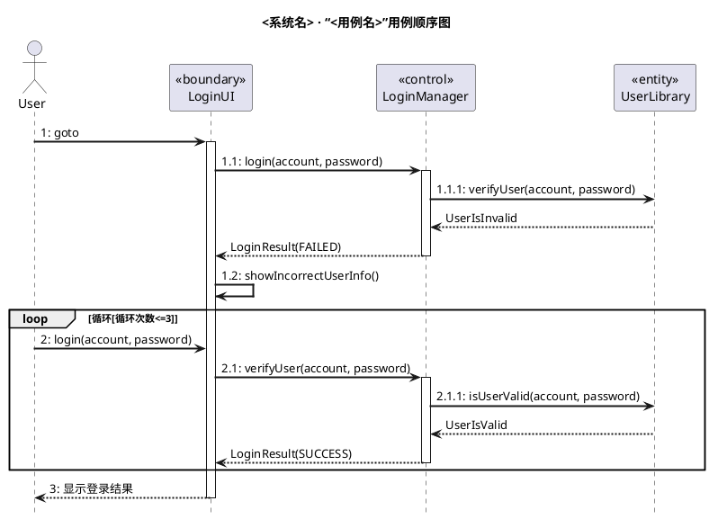
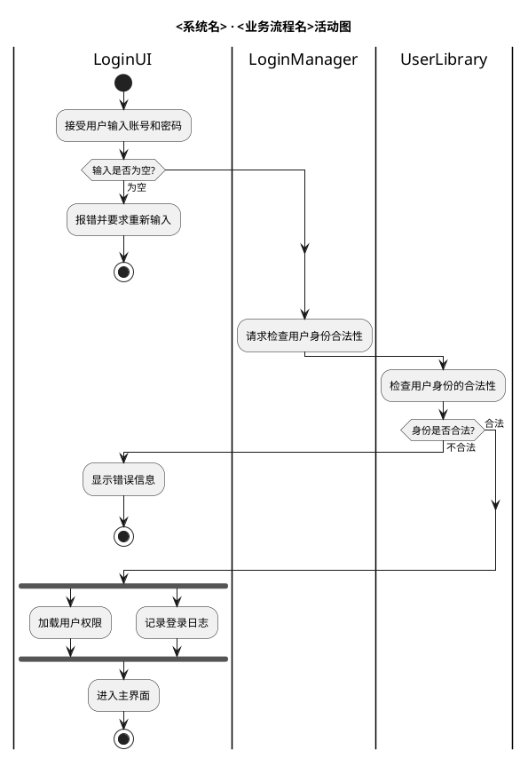
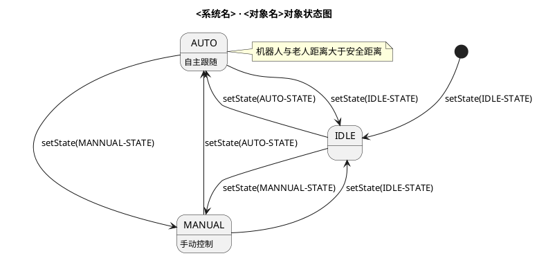
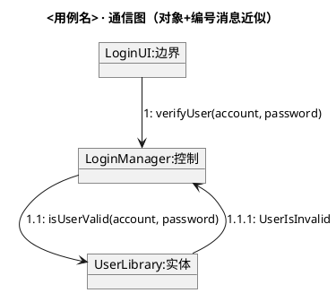

# 行为视图：用例图、顺序图、活动图、状态图、通信图

## 用例图（usecase）

**课件方法要点**
- 要素：执行者（Actor，系统外部使用者，区分主动执行者/被动执行者）、用例（执行者为达成一项相对独立完整的业务目标而与系统的交互序列）、边。
- 执行者与用例间为无向关联边；执行者之间可泛化（如"专家医生"继承"医生"）。
- 用例间三种关系：
  - 包含 include：B 是 A 的必选子功能，用于提取公共子功能（A 包含 B）。
  - 扩展 extend：A 在 B 的某些执行点插入附加动作，区隔例外处理（A 扩展 B）。
  - 继承：A 改写 B 的部分动作序列。
- 一个用例只与直接交互的执行者相连。

**PlantUML 模板（课件风格）**

注意：①执行者与用例间用无向边 `--`（课件规定），用例关系用 `..>` 虚线箭头；②方向：`包含`箭头从 A 指向 B（A ..> B : <<include>>）；`扩展`箭头从扩展用例 A 指向基础用例 B（A ..> B : <<extend>>）。

## 顺序图（sequence）

**课件方法要点**
- 面向对象分析（BCE）布局：外部执行者最左，紧邻其右是边界类（boundary，界面/外部接口），再往右控制类（control），最右实体类（entity）；消息自上而下按时序排列。
- 消息名称用动名词（请求/通知意图），参数用名词或名词短语；可编号（1、1.1、1.1.1）并标注循环（如 `循环[次数<=3]`）。
- 不应出现穿越控制类生命线的消息；业务流程分支用 alt/opt/loop 组合片段表达。
- 一个用例至少一张交互图；复杂用例按场景拆多张。
- 界面设计可用顺序图表示界面跳转流（界面元素作为参与者，跳转动作作为消息）。

**PlantUML 模板（课件风格）**

课件风格要点：参与者用 `participant "«构造型»\n名称" as X` 矩形框（不用 boundary/control/entity 关键字，避免圆圈图标）；编号采用课件式层级（1 / 1.1 / 1.1.1，界面展示类自消息编为 1.2/2.2）；用例约束用黄色 `note`；关键消息可 `-[#red]>` 强调。
常用组合片段：`alt/else/end`（分支）、`loop/end`（循环）、`opt/end`（可选）、`par/end`（并行）、`group`（命名组）；自消息 `A -> A`；返回消息用 `-->`；激活 `activate/deactivate`。

## 活动图（activity）

**课件方法要点**
- 要素：活动（动作执行）、决策点（分支）、边（控制流/信息流）、并发（分叉 fork / 汇合 join）、泳道（活动分区，每区由一个对象或线程负责）、起止点、对象流、收发信号。
- 绘制原则：①决策点出发的每条边必须标注条件，且条件覆盖完整、互不重叠；②fork 与 join 必须配对（每个分叉产生的并发流最终经汇合节点同步合并）；③可用子活动图分层浓缩。

**PlantUML 模板（含泳道与并发）**

条件写在 `if (条件?) then (分支标签) ... else (分支标签) endif`；泳道用 `|对象名|` 切换；并发用 `fork / fork again / end fork`（天然配对）。

## 状态图（state）

**课件方法要点**
- 针对**对象**（而非类）建模，只为生命周期中状态复杂、需响应外部/内部事件的对象画状态图。
- 要素：状态、初态/终态、迁移（事件 [守卫条件] / 动作）。

**PlantUML 模板（课件风格）**

迁移语法：`源 --> 目标 : 事件[守卫条件]/动作`；复合状态用 `state X { ... }`。

## 通信图（communication）

**课件方法要点**：与顺序图同属交互图，强调对象间的链接与编号消息（协作结构而非时序）。

**PlantUML 无原生通信图语法**，两种替代：
1. 用顺序图等价表达（信息完全一致，推荐）。
2. 用对象 + 带编号消息的连线近似：

