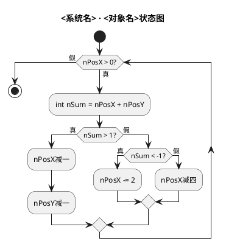
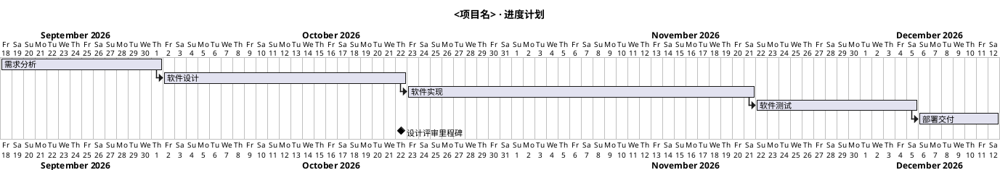
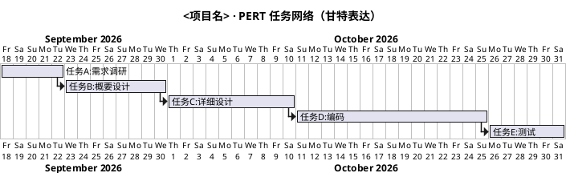
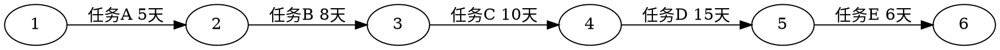

# 测试与项目管理视图：控制流图、甘特图、PERT 网络图

## 控制流图（flow）

**课件方法要点（基本路径测试 / McCabe）**
- 由流程图转换：结构化构件改为有向图，**谓词结点**（条件判断）出度 ≥2；复合条件必须先拆成等价简单条件。
- 节点形式：过程块、判定点、结合点；边代表控制流。
- 环形复杂度 `V(G) = E − N + 2 = 谓词结点数 + 1 = 区域数`（含外部区域），即独立基本路径数。

**PlantUML 模板（活动图新语法可精确表达控制流）**

提示：每个 `if`/`while` 判定即一个谓词结点；可顺带在回复中给出 V(G) 供基本路径测试使用。

## 甘特图（gantt）

**课件方法要点**：左部工作表（任务名称、起止日期），右部条形图；用于描述项目进度计划。

**PlantUML 模板（`@startgantt`，课件风格）**

常用语法：`lasts N days`、`starts D+offset`、`ends`、`->` 依赖、`happens at <日期>` 或 `happens at [任务]'s end` 里程碑、`is colored` 着色、`[任务] is 100% complete`。**注意：甘特图结束标签必须是 `@endgantt`，写成 `@enduml` 会报 HTTP 500**。

## PERT 网络图（network）

**课件方法要点**：PERT/CPM 用有向图描述任务网络——**箭头=任务（标注持续时间），结点=事件**（流入任务完成、流出任务可开始）；计算最早时刻 EFT（正向取 max）与最迟时刻 LET（反向取 min），差值为机动时间，机动时间为 0 的任务连成**关键路径**。

**PlantUML 原生无 PERT 语法**，两种替代：
1. 甘特图表达任务依赖与关键路径（推荐，纯 PlantUML）：

2. 严格 PERT 网络（结点=事件、边=任务）用 Graphviz dot 更贴切：

生成时可主动计算各事件 EFT/LET 并标出关键路径。
