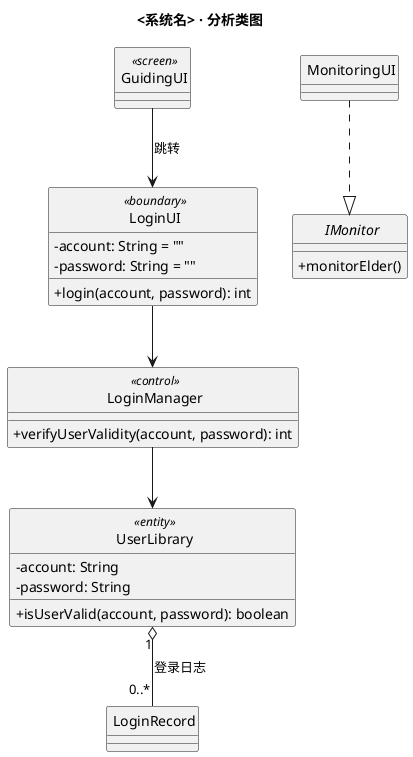
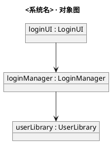
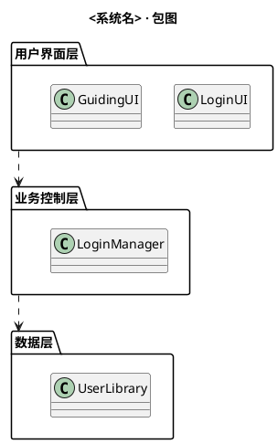
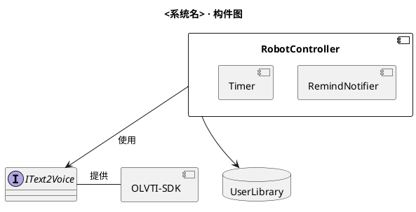
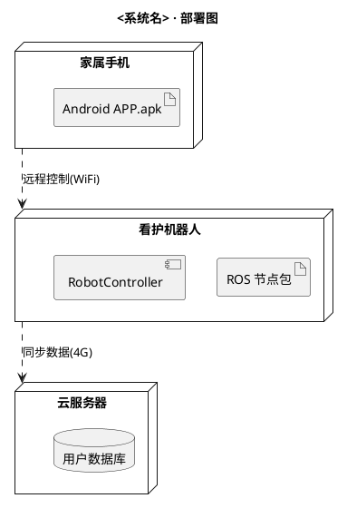
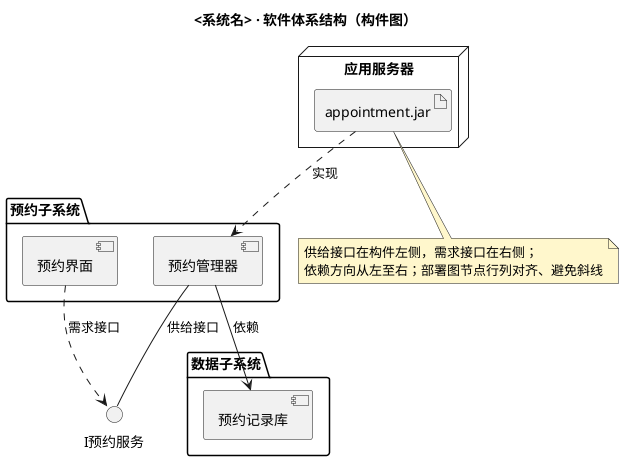

# 结构视图：类图、对象图、包图、构件图、部署图

## 类图（class）

**课件方法要点**
- 分析类三分法：边界类 `<<boundary>>`（与执行者交互）、控制类 `<<control>>`（协调控制）、实体类 `<<entity>>`（持久信息）。
- 分析类图五步：①确定分析类（执行者＋各用例顺序图中出现的对象）→②确定职责（对象接收的消息 ↔ 职责一一对应）→③确定属性（需持久保存/消息参数涉及的数据）→④确定关系（A→B 有消息 ⇒ 关联/依赖/聚合/组合；一般特殊关系 ⇒ 继承）→⑤绘制类图（过大时按子系统拆分）。
- **分析 vs 设计的阶段约定（重要）**：分析类图只画 plain 直线表"有关系"，**不标关系名（如"拥有/发起"）、不标多重性**（SE6 示例即如此）；多重性（1:1/1:n/0:n/n:m）、关系语义强度（继承>组合>聚合>关联>依赖）、属性类型与可见性是 SE10 设计类图"精化类间的关系"阶段的内容。泛化层次（如"患者/医生"继承"用户"）在分析阶段即可标识。
- 设计类图构造：从分析类图、体系结构图、用例顺序图找候选类；职责来自对消息的响应；A 与 B 有消息 ⇒ 有关系；属性＝需保存的数据项；最后按模块化、职责单一化整合。
- 精化规则：属性可见范围默认 private（信息隐藏）；关系语义强度 继承 > 组合 > 聚合 > 关联 > 依赖，尽量采用语义强度较小的关系；多重性 1:1 / 1:n / 0:n / n:m 决定属性形态——1:1 关联/聚合用引用类型属性，1:n 用集合（List）属性，1:1 组合直接持有对象，1:n 组合持有对象集合。
- 详细设计类图可包含子系统 `<>` 和构件 `<<Component>>`。
- 界面设计：界面元素（动态元素、用户输入元素、命令元素）也可建模为类，界面跳转关系可用类图表示（界面类间建立关联）。

**PlantUML 模板（课件风格）**

关系速查：`A <|-- B`（B 继承 A）、`A *-- B`（B 组合于 A，实心菱形在 A 端写作 `A *-- "1" B`）、`A o-- B`（聚合）、`A --> B`（关联/导航）、`A ..> B`（依赖）、`A ..|> B`（实现接口）。可见性 `+ public` `- private` `# protected` `~ package`。多重性 `"1" o-- "0..*"`。

## 对象图（object）

**课件方法要点**：类图的实例层快照，描述某时刻对象及其链接关系，用于示例复杂类图。

## 包图（package）

**课件方法要点**：从包层面描述系统静态结构；类仅被本包使用则私有，否则公开，尽量缩小可见性。

## 构件图（component）

**课件方法要点**：描述构件及其依赖关系、对外接口；构件是粗粒度、可独立部署、可替换的二进制单元。

## 部署图（deployment）

**课件方法要点**：描述工件（artifact）在物理运行环境中的部署，如节点（服务器/设备/机器人）上部署的构件。

## 架构图（软件体系结构）

**课件方法要点（SE8）**
- 体系结构四视图：**逻辑视图**（要素及关系，结构视点，用**包图**表示）、**运行视图**（运行时进程/线程划分及并发同步，用活动图/对象图）、**开发视图**（源代码分包与目录结构、类库/中间件/框架/子系统与逻辑视图的映射）、**物理视图**（构件部署及连接交互，用**部署图**）。
- 描述体系结构的三类 UML 图：**包图、构件图、部署图**。
- 构件图：结点=构件（具有对外接口、可分离、独立功能的物理模块），边=依赖关系；**供给接口画在构件左侧，需求接口画在构件右侧**。
- 部署图：节点=计算资源（Web/应用/数据库服务器），工件以 `<<artifact>>` 标识驻留于节点内；边=通信关联＋依赖（工件间依赖尽量表现为接口上的依赖）；分描述性（逻辑布局）与实例性（具体运行环境，节点命名"节点名: 类型名"）两种。
- 部署图建模原则：节点按行列对齐，边用水平/垂直折线、避免斜线；依赖方向尽量从左至右。

**PlantUML 模板（架构图=包图+构件图+部署图，按视图组合）**

